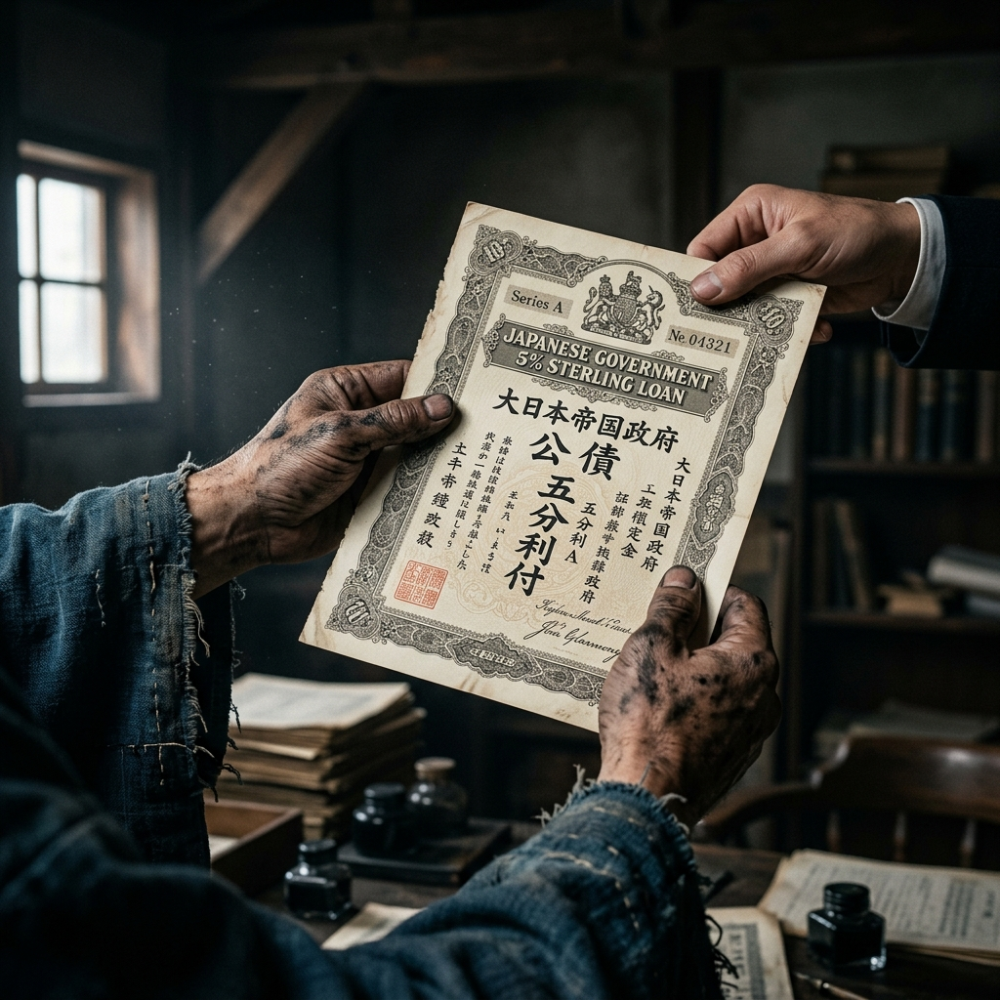

# 001 账本上的绝户计

明治九年（1876年）八月，金泽县厅。

连日未雨，空气里凝滞着一股沉闷的酸暑气。县厅前排起了长龙，队伍里全是穿着旧式和服、腰间还别着木头短刀（真正的武士刀大都已经卖掉或被官方收缴）的旧武士。他们脸上的表情出奇地一致——一半是长期营养不良导致的蜡黄，另一半是面对新政府文官时的局促与愤怒。

柴田辰之助夹在队伍中段。他没有传统武士那种挺拔刻板的身段，常年伏案算账让他的背微微弓着。他习惯性地把双手拢在袖子里，拇指和食指无意识地搓动着，仿佛手里还捏着那把陪伴他长大的算盘。

长龙移动得很慢。每隔半炷香，办事大厅里就会传出一声清晰而沉闷的“喀哒”声。

那是县厅书记官手里的重木印章砸在纸上的声音。每一声“喀哒”，都意味着一个延续了几百年的武士门第，被正式宣判了“死刑”。

“下一个，旧加贺藩，原百石奉行所大番头，佐佐木藤卫门！”年轻的办事员留着西式的分头，鼻梁上架着一副西洋铜丝眼镜，用近乎机械的声音喊道。

一个头发花白、神色倨傲的老武士迈着碎步走上前。哪怕衣服领口已经洗得发白，他依然努力维持着往日的威仪。

“你的秩禄改发金禄公债计算完毕。核定金额：面值八百五十日元，利率五分。这是你的公债证书。”办事员连头都没抬，递过去一张印着繁复西洋花纹的硬纸片，“拿好，按手印，下一位。”

老武士接过那张轻飘飘的纸片，手指有些发抖。他似乎想问什么，但办事员不耐烦的眼神让他咽下了话语，只能木讷地退到了一边。

“下一个！旧加贺藩，御算用者，柴田辰之助！”

听到自己曾被同僚无数次嘲笑的“御算用者”头衔，辰之助面无表情地走上前。

“柴田，原禄高不过十五石吧？你这级别的，不用验算太细。”办事员瞥了他一眼，从旁边的纸堆里抽出一张，随意填了几个数字，“喀哒”一声，大印一盖。

“面值四百一十五日元，利率七分。拿走吧。”

辰之助接过那张纸。很精致的英国凹版印刷，边缘还带有防伪的水印，上面赫然写着四个大字——『金禄公债』。

就在手指触碰纸面的瞬间，辰之助那常年跟账本打交道的大脑，如同拨动了算盘珠子一般，本能地开始了飞速运算。

面值四百一十五日元。年利率七分（7%）。
也就是说，凭借大日本帝国给的这张纸，他柴田家一年能领到的利息是二十九日元零五钱。
除以三百六十五天……
一天差不多是八钱（0.08日元）。

辰之助深吸了一口气，肺里满是夏天湿热的灰尘味。

来县厅的路上，他经过了街角的米店。今天的一俵（约60公斤）玄米挂牌价是：一元三角四分。并且，米店老板正在用粉笔划掉这个数字，准备往上改——市面上的米价几乎一个月涨一次。

而街边扛木头的大工（木匠），一天的工钱都涨到了四十钱。

“一天八钱……”辰之助在心里冷笑了一声，“堂堂大日本帝国，内务卿大久保利通大人，管这叫‘国家恩赐’？”

这根本不是什么恩赐，这是一套精算到骨头缝里的“绝户计”。

大藏省里的那帮账房先生，算准了通货膨胀的速度，算准了这微薄的利息绝对不够买米。更毒辣的是，条例里有一行不起眼的小字：**公债本金前五年绝对不可提现兑换**。

这意味着，政府强行截断了所有底层的现金流。用不了三个月，全金泽、全日本的下级武士就会面临一个死局——要么全家老小活活饿死，要么以腰斩的断头价，把手中这张“面值四百一十五日元”的国债卖给闻着血腥味赶来的投机商人。

不出他所料。

当辰之助刚走出县厅阴凉的屋檐，刺眼的阳光晃得他睁不开眼。就在县厅门口不远处的长街两边，已经像鬣狗一样蹲伏着七八个穿着缎子长衫的掮客。

“哟，佐佐木老爷子！拿到公债啦？”一个留着八字胡的掮客拦住了前面那个白发老武士，笑得满脸堆肉，“这纸片现在在市面上可换不到米吃，五年不让兑现呢！不过咱是老交情，我吃点亏帮您兜着——面值八百是吧？我现洋给您结——两百四十块，当场点清，您看咋样？”

“你……你这奸商！三折？你当抢劫吗！”老武士气得浑身发抖，手本能地去摸腰间的刀柄，却只摸到一块木头。

“老爷子，这可就是不懂规矩了。您去米店问问，除了我们，现在这世道谁敢收这破纸？”掮客冷笑着弹了弹指甲。

辰之助站在阴影里，冷眼看着这一幕。他把自己的那张面值415日元的公债默默折成豆腐块，贴身塞进了和服最深处的夹层里。

属于武士刀的时代已经死透了，连具全尸都没留下。
接下来的乱世，是属于算盘的。

## 第二节 缝隙里的逃生舱

金泽城下町，长町武家屋敷遗址附近。

相比于白天的闷热，夜晚的老宅显得异常阴冷。辰之助推开自家庭院那扇已经朽了一半的木门时，妹妹阿夏正蹲在土灶前生火。锅里煮着看不见几粒米的白萝卜汤。

“哥哥回来了？”阿夏听到脚步声，一边用沾了灰的袖子擦了擦被烟熏红的眼睛，一边转头问道，“拿到公债了吗？”

“拿到了。”辰之助把那张价值四百一十五日元的硬纸片放在了缺角的矮桌上。

他没有提“一天八钱”的事，只是脱下被汗水浸透的旧和服，从床铺底下拖出一只满是灰尘的桐木箱子。这里面装的并非武士世家引以为傲的刀剑谱，而是一大堆抄写着片假名和汉字的政府文书——这是他以前在奉行所当“御算用者”时，靠着职务之便偷偷誊抄的各类新政府政令。

辰之助点亮了那盏平时根本舍不得用的菜油灯。昏黄的火苗跳动着，照亮了他那双布满墨渍的手。

米缸里只剩下不到三天的口粮。如果按掮客的“三折”价把公债卖了，拿到一百二十多日元，熬过这个冬天固然没问题，但明年呢？后年呢？那是真正的饮鸩止渴。

“大藏卿大隈重信是个精算师，但他绝不会把全国的士族逼到同时造反的绝境。太政官的公文里，一定、一定留有泄压的阀门。”

辰之助像个疯魔的苦行僧，在一堆散发着霉味的公文中翻找。大藏省发行的《国立银行条例》、《金禄公债证书发行条例》、《兑换纸币条例》……密密麻麻的条款在昏暗的光线下犹如扭曲的蚂蚁。

找漏洞。
像以前在账本里抓做假账的硕鼠一样，找那群东京的最高官僚在政策里留下的后门。

时间一滴一滴过去，油灯里的灯芯发出轻微的爆裂声。

突然，辰之助的手指停在了一份刚刚下发不久、字迹还很新的副本上——修订于本月（明治九年八月）的**《国立银行条例（修正案）》**。

他的呼吸停滞了。视线死死钉在了第三条的一行附属小字上：

『……凡设立国立银行者，其资本金之十成，允许以**八成**之政府发行的**金禄公债**充当。其余二成以正货（现金）充当……银行可将其持有的金禄公债抵押于大藏省，从而获得等额的**银行纸币发行权**……』

辰之助猛地抓起了桌上的旧算盘。

“啪！嗒！啪！……”

寂静的破屋里，算盘珠子撞击的清脆声如骤雨般响起。比起白日里县厅盖章那沉闷的“喀哒”声，这声音显得生机勃勃，充满锋芒。

“八成……如果是八成的话……”

由于手指拨动得太快，辰之助的额头渗出了大颗大颗的汗珠。

一条清晰的逻辑链条，在算盘珠子的碰撞中轰然成型：
国家规定，金禄公债前五年绝对不准兑换成现金。这是一张“死钱”。
但是！如果能凑齐大批的武士，把手里的公债集中起来，达到设立银行的法定资本底线（比如五万日元）。那么，这批废纸就能变成合法的“银行资本金”！
并且，把这批公债抵押给大藏省，就能直接印发等额的“国立银行纸币”！纸币是可以在市面上买米、买房、做生意的“活钱”啊！

这就是那个藏在晦涩公文里的“逃生舱”！

不用三折贱卖给街头那帮高利贷掮客，不用去投资那些根本不懂真假的“洋务工厂”。只需吃透规则，用魔法打败魔法，用公债去套取国家发行的流动资金。

“五万日元……”辰之助停下了手中的算盘，看着上面定格的数字。

设立哪怕是最小级别的地方国立银行，最低资本金也需要五万日元。按八成折算，需要四万日元的公债。

以他这张区区415日元的破纸，连零头都不够。他需要再去找到至少一百个像他一样的下级武士，说服他们不把公债卖给掮客，而是交给他这个连刀都不会拔的“穷酸账房”。

这是一场难度远超在战场上杀敌的豪赌。

“锅里的汤热好了。”阿夏端着半碗漂着几片萝卜的清汤，小心翼翼地放在矮桌上。

辰之助没有接碗。他盯着摇曳的油灯，眼中闪烁着在战场上的武士都不曾有过的炽热光芒。

“阿夏，”他轻声说道，声音因为极度的兴奋而有些沙哑，“明天早上，把你那件结婚用的好绸缎和服找出来当掉吧。”

“当掉？哥，那可是妈妈留下的……”阿夏愣住了。

“只当半个月。我们需要钱买几瓶好酒上门送礼。”辰之助站起身，目光穿过破旧的窗棂，看向在这夜色中哀嚎的千百个武家屋敷（武士老宅）。

“我要去收废纸。顺便，给金泽的旧武士们，建个钱庄。”
