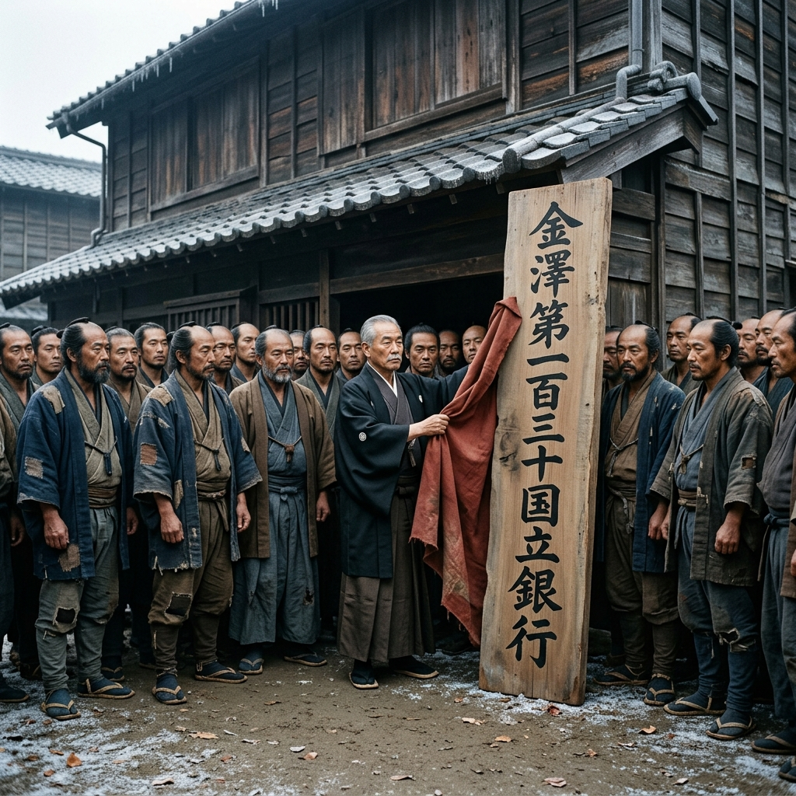

# 016 第一百三十国立银行的诞生

明治九年（1876年），初冬的清晨，一场冷雨刚刚洗刷过金泽长町的石板路。

这里没有东京那些财阀银行高耸的红砖洋楼，也没有擦得锃亮的黄铜旋转门。在和泉屋原先最靠街头的一座半旧不新的两层米仓前，三十多个穿着洗得发白、甚至打着补丁的旧和服的男人，正搓着手、激动地在一块用红布盖着的木牌前等待着。

“时辰差不多了。”

随着前田左卫门沉稳的一声令下，和泉屋大掌柜庄兵卫亲自上前，有些粗鲁却极为干脆地一把扯下了红布。

一块由前田亲自提笔、毫无西洋花哨装饰、完全由遒劲有力的汉字写就的原木大牌匾赫然出现——
**【金泽第一百三十国立银行】**

没有震耳欲聋的礼炮声，也没有东京财阀开业时那种极尽奢华的西洋铜管大乐队，更没有各路洋务大官的剪彩。这三十多名在饥饿边缘徘徊了三个月的底层武士，看着这块原本只是一堆根本换不出钱的废纸“公债”凑出来的牌匾，不少人红了眼眶。

**“开业！”**

随着这声极其朴素的号子，这间全日本最寒酸、也是最特殊的国立银行，正式在金泽的寒风中敞开了大门。

走进去，与其说是银行，不如说更像个收拾得出奇干净的大当铺。

没有大理石柜台，只有几张拼凑在一起的红木长桌。连伙计们穿的制服，都是用旧武士服改裁而来的统一样式，虽然破旧，但每个人都洗得干干净净，站得笔直。

而在这间寒酸银行的最深处，也是这里唯一称得上“值钱”的物件——是一台庄兵卫花了大价钱从横滨二手市场淘回来的、重达上千斤的西洋铸铁保险箱。

此刻，保险箱的沉重大门正敞开着。里面整齐地码放着一万块白花花的现洋储备金，以及经过大藏省特许、用他们四万块金禄公债作为抵押，刚刚印发出来、散发着刺鼻油墨味的新版“国立银行兑换纸币”。

这就是他们三十一家老小的脊梁骨。

“发什么呆呢？柴田……不对，现在该改口叫‘柴田头取’（行长 / 总经理）了！”

庄兵卫拍了拍正站在保险箱前发呆的辰之助，将一本崭新的西式皮面烫金《大福账》重重地塞进他手里。

那是这间银行的**总账本**。

在昨晚的闭门会议上，关于谁来坐这间银行的第一把交椅（支配人/头取），发生了一场极其罕见的推让。

前田左卫门虽然自尊心极高，但他很有自知之明：武士会砍人，但在错综复杂的西洋数字和复式商法面前，让他当行长只会把大家带进局子里。所以他只要了一个象征极高荣誉的“取缔役会长（董事长）”头衔。
而大商人庄兵卫，虽然精于算计又出了绝大部分现金，但他深刻明白自己压不住那些脾气暴躁的下级武士，而且他需要避嫌，以免别人说商人吞了武士的钱。

于是，在所有人的全票通过（连判状的约束）下——
柴田辰之助，这个原本连拔刀都不利索、只想在乱世里保住自家长町破宅子的小小底层“御算用者”，正式被推上了**“金泽第130国立银行·初代头取（行长）”**的最高业务统帅大位。

辰之助低头看了看自己这身有些洗得发白的粗布衣服，又看了看桌子上那把他用了十几年的发黑的木算盘。哪怕现在当了行长，这把老算盘他依然没舍得扔。

“庄兵卫老板，你看我这身行头，像个管着五万日元大资金的行长吗？”辰之助难得地开了一句玩笑。

“只要你脑子里的那套‘十字阵法’和‘私法契约’不丢，你就算穿破布，在东京那帮财阀眼里也是个硬茬子！”庄兵卫大笑着，递过来一杯热茶。

就在这时，银行那扇简陋的木门，被轻轻推开了。

所有人立刻噤声，甚至连高桥等人都紧张地挺直了腰板。这可是金泽第一百三十国立银行的第一笔生意！会是哪个大商人来存几千大洋吗？

门外走进来的，并不是什么腰缠万贯的大贾，而是一个头上包着旧布巾、被冬日的寒风冻得瑟瑟发抖的卖菜老妪。

她有些局促地看着这间站满了带刀汉子（哪怕刀已经换成了算盘）的屋子，手里死死攥着一枚最小面额的一日元纸币，声音因为害怕而有些颤抖：

“那个……各位大人。听说这是家新开的钱庄？你们连洋人的规矩都懂……那能不能、能不能帮老身把这张一日元的纸币，破开换成五十文的铜钱？我家老头子病了，得去街角抓副药，药铺不收整张的纸币……”她生怕被赶出去，赶紧补充道，“我可以出三文钱的手续费！”

屋子里安静得连一根针掉在地上都能听见。
所有人下意识地看向了高高坐在行长位置上的柴田辰之助。

按照那些东京大银行的规矩，或者以前高利贷的门坎，这种只换一元还满身泥土的乡下老婆子，是连大门都进不来的。

辰之助站起身，理了理洗得发白的衣摆。

他走出柜台，亲自来到那个冻得发抖的老妪面前。他双手极其恭敬地接过了那张被捏得皱巴巴的一日元纸币，仿佛接过的是千金重托。

“高桥。”辰之助转过头，声音温和却极具穿透力，“给这位阿婆兑换一百文铜钱，也就是一整日元。不需要收取任何手续费。”

“是！头取！”高桥抹了一把眼角激动的水渍，转身走向那沉重的保险箱。

辰之助看着老妪，微微欠身鞠了一躬：“阿婆，这间银行，也是我们三十几个穷兄弟把身家性命全押进去、才在这世道里活下来的。我们不是那些高高在上的财阀，只要是能给人续命的钱财，无论多小，无论多破……这扇门，永远为您敞开。”

老妪拿着换好的、沉甸甸的一吊铜钱，千恩万谢地走入了冬日的寒风中。虽然外面依旧寒冷，但在这一刻，在这间用旧米仓改建的破烂大堂里，所有武士的心里却像生起了一团火。

辰之助走回自己的长桌。

他翻开那本崭新的西式《大福账》，在第一页的最中心画下了一个粗犷的十字。
他在左侧的“借方（现金资产）”和右侧的“贷方（兑换负债）”上，郑重其事、一笔一划地写下了这间极度寒酸的银行的第一笔账：

【借】现金一日元。
【贷】零钱兑换负债一日元。
**【余额】：绝对平衡。**

算盘噼啪一声清脆的归零。

窗外的冬雪终于开始飘落，但金泽城底层武士和这群泥腿子们的寒冬，随着这笔看似微不足道的账目，似乎终于熬到头了。

（第二卷·现代金融合规篇 完）

[下一章：纸币的枷锁与零业务死局](./017_纸币的枷锁与零业务死局.md)
