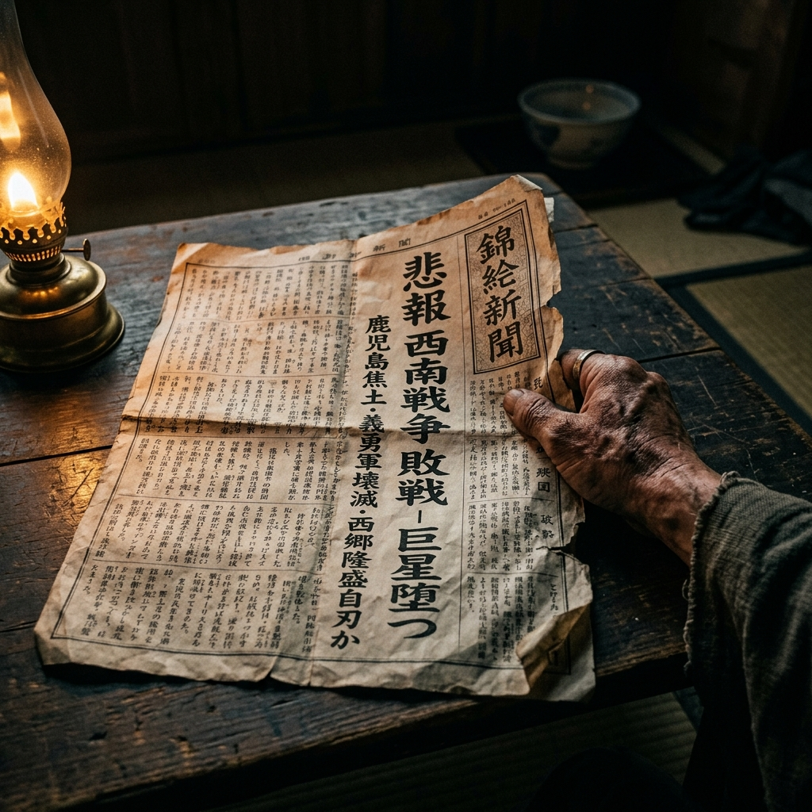

# 外传 二：清算之网与九州的血

冬夜，金泽长町的第一百三十国立银行大堂。

火炉里的无烟炭发出轻微的剥啄声，驱散了北陆彻骨的严寒。打赢了“生丝汇票之战”后，银行的库房里终于第一次飘荡着实打实的利润香气。而此刻，大堂里却异乎寻常的安静。

高桥捏着一张从横滨洋行买办那里讨来的、有些皱巴的《东京日日新闻》，手微微发抖。几个挤在他身后的年轻武士，死死盯着报纸上那极其刺眼的铅字标题，脸色惨白。

**《熊本镇台遇袭：神风连之乱，两百武士血染火网！》**
**《萩之乱平定：前参议前原一诚枭首，旧士族叛乱遭新式加特林机枪全歼！》**

“全……全成了肉泥。”高桥捏着报纸边缘的粗糙手掌在剧烈发抖，他的声音哑得像吞了砂纸。

根据报纸上随行记者的白描，那些因为《废刀令》和《秩禄处分》活不下去的九州武士，扯碎了政府下发的“金禄公债”，拒绝使用任何西洋火器，拔出祖传的打刀和长矛，迎着政府军阵地上每分钟倾泻数百发子弹的西洋加特林机枪冲锋。

结果甚至称不上战争，那是一场毫不留情的单方面屠杀。曾经被誉为天下无双的九州剑士，连政府军的衣角都没碰到，就被钢铁风暴撕成了碎片。尸体堆成了小山，没死的武士甚至没有一块完整的肚子用来切腹。

“如果……如果在制丝场那天，我们拔刀砍了高利贷松井……”一个年轻武士咽了口唾沫，恐惧地看了看腰间空荡荡的刀带。

“如果那天你们拔出刀，你们现在的下场，就会和报纸上这两百多个白痴一样。要么被警察拉去刑场枪毙，要么在监狱里饿死。”

辰之助坐在高高的行长柜台后，头也没抬。他手里正拿着一块鹿皮，细细擦拭着一根又一根被磨得锃亮的算盘指针。

“我早说过，那个靠着一身血肉之躯和一把冷兵器就能出将入相的时代，已经彻底死了。”辰之助把抹布扔在桌上，发出啪的一声轻响，“九州的武士想要杀回旧时代，所以他们死了。而我们想活下去，就必须学会用新时代的武器杀人。”

高桥放下报纸，看着安静燃烧的火炉，心中突然涌起一股极其强烈的荒谬感与敬畏感。

“行长，”高桥走到柜台前，他现在对辰之助的称呼已经彻底从戏谑变成了死心塌地的尊称，“我一直想不通，长野县的第四十一国立银行，和咱们素昧平生，连个招呼都没打过。咱们在金泽这边发一封电报，他们凭什么就像亲兄弟一样，乖乖从他们的金库里拿出五千块白花花的现洋，付给那个卖蚕茧的老农？他们难道不怕咱们发的是假电报，骗他们的钱吗？”

“亲兄弟？”辰之助冷笑了一声，“在复式账本里，没有亲兄弟，只有‘借方’和‘贷方’。你以为大日本帝国设立了那么多家‘国立银行’，只是为了在不同的城池里立几块牌坊吗？”

辰之助拿起粉笔，在身后的黑板上画下了两座金库，中间用虚线连了起来。

“这个世界上，最可怕的武器从来不是大炮，而是叫做**‘代理清算之网（Corspondent Banking / コルレス契約）’**的东西。”

他指着左边的金库：“这就是我们130银行。右边是长野的41银行。在我们开业拿到大藏省牌照的那一天，庄兵卫大掌柜就已经通过和泉屋的商路，在长野的41银行里，以‘金泽130银行’的名义，悄悄存进了一笔一千块钱的备用金。同样，长野的银行，也在我们金库的账本上开立了一个他们的影子账户。”

“这叫**‘往来联行账户’**。大藏省发行同样形制的‘国立银行纸币’，就是为了让全日本的钱庄能说同一种语言！”

辰之助用粉笔狠狠地在这张网上画了一个表示电波的闪电符号：“所以，昨晚发出的那封电报，根本不是在求长野的银行‘借钱’给我们。那是一串极其冷酷的密码指令！”

“那串密码在电线里跑了几百里，钻进长野行长的耳朵里，翻译过来就是：**‘从我们在你们那里的存款账户里，立刻扣掉五千块现洋。不够的四千块，算我们130银行对你们的合法金融透支（拆借），按大藏省规定的同业拆借利率（5%）日结计息！’**”

高桥听得目瞪口呆，这已经完全超出了一个传统武士对“金钱借贷”的认知。

“只要有大藏省的密押大印，只要两家银行的信用没有破产，这张网里甚至不需要流动一连串真实的硬币，只需要两个驼背的老出纳，在各自的《大福账》上互相用笔划去一笔借款，加上一笔利息，一单涉及五千现洋、足以让松井的高利贷马帮在山里走上十天半个月的生意，两柱香的功夫就结束了。”

“这就是金融资本的终极降维打击。”辰之助转过身，看着外面黑压压的风雪，“它把整座大日本帝国的金库，用电报线和账本缝合在了一起。只要你敢碰这张网里的一根蛛丝，全日本的资金都会在瞬间对你形成合围。”

他指了指高桥手里的报纸，眼神深邃得令人胆寒。

“九州的那帮傻子，拿着一把几斤重的破铁片，去砍大藏省和财阀们用大炮和全国财政编织起来的天罗地网，怎么可能不死？”

高桥看着手中那份沾满血字新闻的《东京日日新闻》，又回头看了看那尊代表着130国立银行最高权力的西洋大铁柜。

在这个寒冷的冬夜里，他终于彻底醒悟。
武士的时代连最后的一丝余烬都被浇灭了，取而代之的，是这群穿着破和服、疯狂敲击着算盘，用冰冷的流水账和清算网络去绞杀旧世界的……新时代金融财阀的雏形。

[下一章：赎回的和服与碎银子](./020_赎回的和服与碎银子.md)
